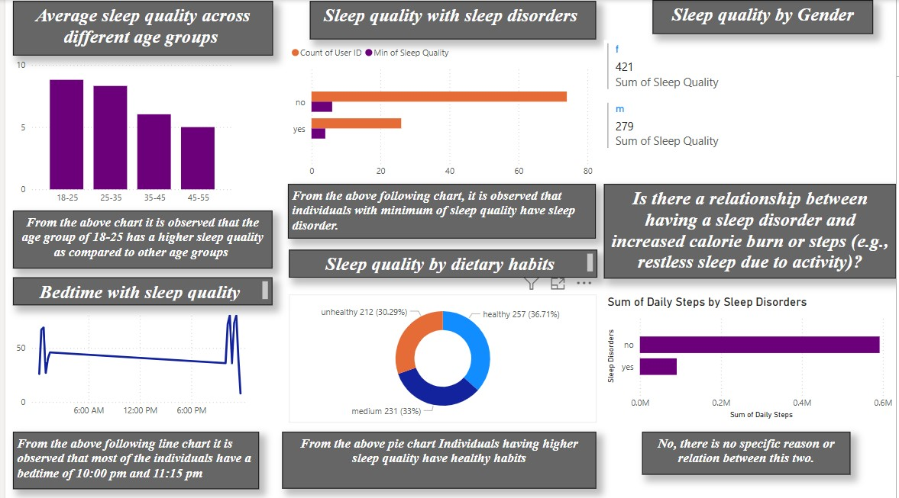

# Power BI Report – Health and Sleep Analysis
This Power BI report provides insights into individual or population-level health and sleep patterns. It visualizes how sleep duration, quality, and related health metrics impact overall wellness.

## Key Insights

- Average sleep duration over time
- Correlation between sleep quality and daily activities
- Trends in stress, mood, and physical health indicators
- Comparison of weekdays vs. weekends
- Personalized recommendations (if included in your data)

## Preview

## Files
- `Sleep_health_report.pbix` – Power BI report file
- `Preview.png` – Screenshot of the dashboard

## Data Source

This report is based on the publicly available dataset from Kaggle:

**[Health and Sleep Statistics – by Hasan Aksoy](https://www.kaggle.com/datasets/hanaksoy/health-and-sleep-statistics)**

The dataset contains sleep and health-related data including:
- Sleep duration and quality
- Heart rate and physical activity
- Stress levels and alcohol consumption
- Gender and age

> The dataset is not included in this repository due to licensing.  
> Please download it directly from Kaggle if you'd like to explore or reproduce the analysis.

## How to Use

1. Download the `sleep_health_report.pbix` file from this repository.
2. Open it using **Power BI Desktop** (free from Microsoft).
3. Use the slicers and visuals to explore trends in sleep and health metrics.
